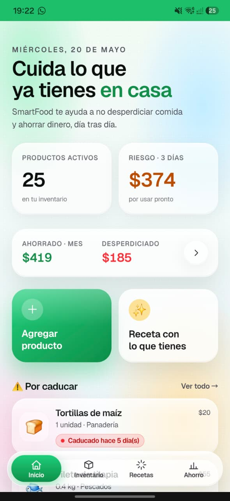
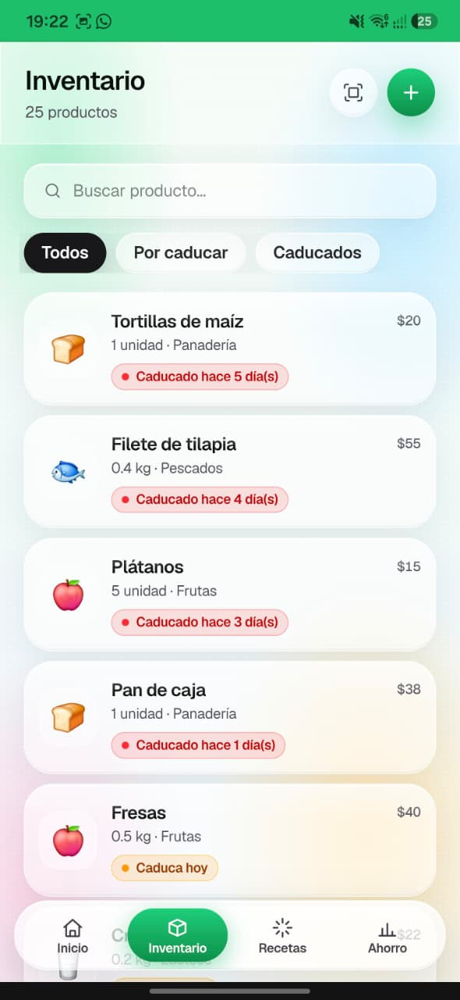
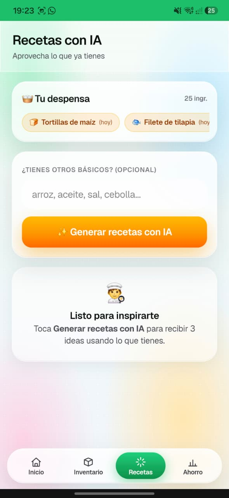
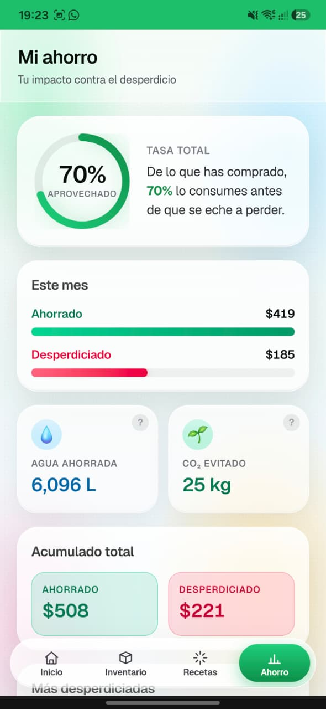

# SmartFood — Gestor Inteligente de Despensa

> Reduce el desperdicio alimentario en tu hogar con IA. Escanea tickets, gestiona tu inventario, genera recetas y mide tu impacto ambiental.
> Demo en vivo disponible. Desplegado en vercel.
> https://smart-foodapp.vercel.app
---

## Descripción

**SmartFood** es una aplicación web mobile-first desarrollada con Next.js 16 que ayuda a los usuarios a prevenir el desperdicio de alimentos. Combina gestión de inventario, inteligencia artificial (OpenAI GPT-4o-mini) y métricas de impacto ambiental en una interfaz glassmorphism inspirada en VisionOS.

El sistema permite registrar productos manualmente o escaneando tickets de compra con IA, recibe alertas de caducidad, genera recetas personalizadas según lo disponible en la despensa y visualiza cuánta agua y CO₂ se ha ahorrado al no desperdiciar alimentos.

---

## Capturas de pantalla

| Dashboard | Inventario | Recetas con IA | Mi Ahorro |
|:---------:|:----------:|:--------------:|:---------:|
|  |  |  |  |
| Métricas rápidas, valor en riesgo y accesos directos | Lista con búsqueda y filtros por caducidad | Genera 3 recetas con lo que tienes en despensa | Tasa de consumo, ahorro mensual e impacto ambiental |

---

## Características principales

- **Dashboard** — Métricas en tiempo real: productos activos, valor en riesgo, ahorro mensual, productos próximos a vencer y recientes.
- **Inventario** — Lista completa con búsqueda por nombre y filtros por estado (todos / urgentes / vencidos). Navegación al detalle para editar, marcar como consumido/desperdiciado o eliminar.
- **Escaneo de tickets con IA** — Sube una foto del ticket de compra; GPT-4o-mini extrae automáticamente nombre, precio, cantidad y categoría de cada producto. Revisa y confirma antes de guardar.
- **Agregar producto manual** — Formulario con selección de categoría (scroll horizontal), cantidad, unidad, precio, fechas de compra y caducidad. La caducidad se auto-sugiere según los días típicos de la categoría.
- **Detalle de producto** — Visualiza todos los atributos, edita campos, marca el estado del ciclo de vida (activo → consumido / desperdiciado).
- **Generador de recetas con IA** — Muestra el contenido de la despensa activa, acepta ingredientes extras opcionales y solicita a GPT-4o-mini 3 recetas completas con ingredientes usados, faltantes y pasos detallados en acordeones colapsables.
- **Estadísticas de impacto** — Ahorro vs desperdicio mensual/histórico, gráfica donut de tasa de consumo, tiles de impacto ambiental (litros de agua y kg de CO₂ ahorrados con fuentes citadas), ranking de categorías con más desperdicio.

---

## Stack tecnológico

| Capa | Tecnología |
|------|-----------|
| Framework | Next.js 16.2.6 (App Router) |
| UI Library | React 19.2.4 |
| Lenguaje | TypeScript (strict) |
| Estilos | Tailwind CSS v4 (`@tailwindcss/postcss`) |
| Base de datos | Supabase (PostgreSQL) |
| Autenticación | Supabase Auth |
| IA / LLM | OpenAI GPT-4o-mini (vision + chat) |
| Tipografía | Geist Sans / Geist Mono (Vercel) |
| Linting | ESLint flat config (`eslint-config-next`) |

---

## Estructura del proyecto

```
food-app/
├── src/
│   ├── app/                          # App Router (páginas y rutas)
│   │   ├── layout.tsx                # Layout raíz: BottomNav, fuentes, metadata
│   │   ├── page.tsx                  # Dashboard principal
│   │   ├── globals.css               # Variables CSS, glass system, phone-shell
│   │   ├── icon.png                  # Favicon / App Icon
│   │   ├── inventario/
│   │   │   ├── page.tsx              # Lista de inventario con búsqueda y filtros
│   │   │   ├── actions.ts            # Server Actions: CRUD de productos
│   │   │   ├── nuevo/
│   │   │   │   └── page.tsx          # Formulario para nuevo producto
│   │   │   ├── escanear/
│   │   │   │   └── page.tsx          # Escáner de tickets con IA
│   │   │   └── [id]/
│   │   │       ├── page.tsx          # Detalle y edición de producto
│   │   │       └── ProductActions.tsx# Botones de acción (consumido/desperdiciado/eliminar)
│   │   ├── recetas/
│   │   │   ├── page.tsx              # Página de recetas (server component)
│   │   │   ├── RecipesClient.tsx     # UI interactiva de recetas (client component)
│   │   │   └── actions.ts            # Server Action: suggestRecipes (OpenAI)
│   │   ├── estadisticas/
│   │   │   └── page.tsx              # Estadísticas, gráficas e impacto ambiental
│   │   └── api/
│   │       └── scan-ticket/
│   │           └── route.ts          # POST: análisis de ticket con OpenAI Vision
│   ├── components/                   # Componentes reutilizables
│   │   ├── AppHeader.tsx             # Header sticky con título, subtítulo y botón atrás
│   │   ├── BottomNav.tsx             # Barra de navegación inferior (4 tabs)
│   │   ├── ProductCard.tsx           # Tarjeta de producto con estado de caducidad
│   │   ├── ProductForm.tsx           # Formulario grande de crear/editar producto
│   │   ├── TicketScanner.tsx         # Flujo 3 pasos: subir → escanear → revisar
│   │   ├── ImpactTile.tsx            # Tile de métrica ambiental con modal explicativo
│   │   └── RecipesClient.tsx         # Chips de despensa, extras, acordeones de recetas
│   ├── lib/
│   │   ├── types.ts                  # Tipos: Category, Product, ProductWithCategory, etc.
│   │   └── dates.ts                  # Utilidades: daysUntil, expiryStatus, formatDate, etc.
│   ├── utils/
│   │   └── supabase/
│   │       ├── server.ts             # Cliente Supabase para Server Components
│   │       ├── client.ts             # Cliente Supabase para el navegador
│   │       └── middleware.ts         # Cliente Supabase para middleware
│   └── middleware.ts                 # Refresco automático de tokens de auth
├── public/                           # Assets estáticos (SVGs de Next.js)
├── .env.local                        # Variables de entorno (no subir al repo)
├── next.config.ts                    # Configuración de Next.js
├── tsconfig.json                     # TypeScript strict, alias @/*
├── postcss.config.mjs                # Plugin Tailwind CSS v4
└── eslint.config.mjs                 # ESLint flat config
```

---

## Configuración e instalación

### Prerequisitos

- Node.js 18.x o superior
- Cuenta en [Supabase](https://supabase.com) (plan gratuito funciona)
- API Key de [OpenAI](https://platform.openai.com) con acceso a GPT-4o-mini

### 1. Clonar el repositorio

```bash
git clone <url-del-repo>
cd food-app
```

### 2. Instalar dependencias

```bash
npm install
```

### 3. Configurar variables de entorno

Crea un archivo `.env.local` en la raíz del proyecto:

```env
# Supabase
NEXT_PUBLIC_SUPABASE_URL=https://<tu-proyecto>.supabase.co
NEXT_PUBLIC_SUPABASE_PUBLISHABLE_KEY=<tu-publishable-key>

# OpenAI
OPENAI_API_KEY=sk-proj-<tu-api-key>
```

### 4. Configurar la base de datos en Supabase

Ejecuta el siguiente SQL en el editor de Supabase para crear las tablas:

```sql
-- Tabla de categorías
create table categories (
  id   uuid primary key default gen_random_uuid(),
  name text not null,
  icon text not null,
  shelf_days int not null  -- días típicos de vida útil
);

-- Tabla de productos
create table products (
  id            uuid primary key default gen_random_uuid(),
  name          text not null,
  category_id   uuid references categories(id) on delete set null,
  quantity      numeric not null default 1,
  unit          text not null default 'unidad',
  price         numeric,
  purchase_date date,
  expiry_date   date,
  status        text not null default 'active' check (status in ('active','consumed','wasted')),
  consumed_at   timestamptz,
  note          text,
  created_at    timestamptz not null default now()
);

-- Datos semilla de categorías
insert into categories (name, icon, shelf_days) values
  ('Frutas',      '🍎', 7),
  ('Verduras',    '🥦', 5),
  ('Lácteos',     '🥛', 14),
  ('Carnes',      '🥩', 3),
  ('Pescados',    '🐟', 2),
  ('Panadería',   '🍞', 4),
  ('Congelados',  '🧊', 90),
  ('Bebidas',     '🧃', 30),
  ('Enlatados',   '🥫', 365),
  ('Condimentos', '🧂', 180),
  ('Cereales',    '🌾', 180),
  ('Snacks',      '🍿', 60),
  ('Otros',       '📦', 30);
```

### 5. Iniciar el servidor de desarrollo

```bash
npm run dev
```

Abre [http://localhost:3000](http://localhost:3000) en tu navegador.

---

## Scripts disponibles

```bash
npm run dev      # Servidor de desarrollo con Turbopack (http://localhost:3000)
npm run build    # Build de producción
npm start        # Servidor de producción (requiere build previo)
npm run lint     # ESLint con reglas de Next.js
```

---

## Flujos de datos

### Agregar producto manualmente

```
ProductForm (client) → Server Action createProduct → Supabase INSERT
                     → revalidatePath(['/','inventario']) → redirect('/inventario')
```

### Escanear ticket con IA

```
TicketScanner (upload) → POST /api/scan-ticket → OpenAI Vision (GPT-4o-mini)
                       → JSON { products: [...] } → UI de revisión
                       → Server Action createProducts (bulk) → Supabase INSERT
```

### Generar recetas con IA

```
RecipesClient → Server Action suggestRecipes → Supabase (obtiene productos activos)
              → OpenAI Chat (GPT-4o-mini) → JSON { recipes: [...] }
              → Render acordeones: usa / faltan / pasos
```

### Ver estadísticas

```
estadisticas/page.tsx (server) → Supabase (todos los productos)
                               → Cálculo: ahorro vs desperdicio, tasa de consumo
                               → Fórmulas CO₂ y agua → Render con gráficas
```

---

## Modelo de datos

### `categories`

| Campo | Tipo | Descripción |
|-------|------|-------------|
| `id` | uuid | Clave primaria |
| `name` | text | Nombre de la categoría (ej. "Frutas") |
| `icon` | text | Emoji representativo |
| `shelf_days` | int | Días típicos de vida útil |

### `products`

| Campo | Tipo | Descripción |
|-------|------|-------------|
| `id` | uuid | Clave primaria |
| `name` | text | Nombre del producto |
| `category_id` | uuid | FK a categories (nullable) |
| `quantity` | numeric | Cantidad |
| `unit` | text | Unidad (`unidad`, `kg`, `g`, `L`, `ml`, `paquete`) |
| `price` | numeric | Precio de compra (MXN) |
| `purchase_date` | date | Fecha de compra |
| `expiry_date` | date | Fecha de caducidad |
| `status` | text | Estado: `active`, `consumed`, `wasted` |
| `consumed_at` | timestamptz | Timestamp cuando se marcó consumido/desperdiciado |
| `note` | text | Notas adicionales |
| `created_at` | timestamptz | Fecha de creación del registro |

---

## Diseño y sistema visual

La interfaz utiliza un sistema de **glassmorphism** con fondo aurora animado:

- **Colores de marca:** Verde principal `#1cbf6a`, verde fuerte `#0e8f4a`
- **Aurora:** Pasteles animados (menta, azul, durazno, rosa) en el fondo
- **Clases de cristal:** `.glass`, `.glass-strong`, `.glass-tint`, `.glass-dark` con `backdrop-filter: blur + saturate`
- **Phone-shell:** Marco de teléfono centrado (`max-width: 28rem`, `border-radius: 44px`) en pantallas ≥ 480px
- **Tipografía:** Geist Sans para texto, Geist Mono para datos numéricos
- **Animaciones:** Transiciones cúbicas `220ms / 420ms / 600ms`

---

## Cálculo de impacto ambiental

El módulo de estadísticas calcula automáticamente el impacto de no desperdiciar:

- **Agua ahorrada:** Basado en el litros de agua virtuales por kg de cada tipo de alimento
- **CO₂ ahorrado:** Basado en la huella de carbono promedio de alimentos no desperdiciados

Las métricas se muestran en `ImpactTile` con modal explicativo y enlace a la fuente científica.

---

## Patrones arquitectónicos

| Patrón | Implementación |
|--------|----------------|
| Server-first | La mayoría de páginas son Server Components async que hacen fetch directo a Supabase |
| Server Actions | Mutaciones de formularios con `"use server"` en `actions.ts` |
| Client Islands | Componentes con interactividad (`"use client"`): `TicketScanner`, `RecipesClient`, `BottomNav`, `ProductForm` |
| Dynamic rendering | `export const dynamic = "force-dynamic"` en inventario, recetas y estadísticas |
| Cache invalidation | Mutaciones llaman `revalidatePath()` en rutas afectadas |
| Middleware auth | `src/middleware.ts` refresca tokens de Supabase en todas las requests |

---

## Variables de entorno requeridas

| Variable | Descripción |
|----------|-------------|
| `NEXT_PUBLIC_SUPABASE_URL` | URL de tu proyecto Supabase |
| `NEXT_PUBLIC_SUPABASE_PUBLISHABLE_KEY` | Publishable key de Supabase (segura para el cliente) |
| `OPENAI_API_KEY` | API Key de OpenAI para recetas y escaneo de tickets |

---

## Despliegue en producción

La forma más sencilla es desplegar en **Vercel**:

1. Sube el repositorio a GitHub
2. Importa el proyecto en [vercel.com](https://vercel.com)
3. Configura las variables de entorno en el dashboard de Vercel
4. Haz deploy — Vercel detecta automáticamente Next.js

Para otros proveedores, ejecuta `npm run build && npm start` y sirve desde cualquier host con soporte Node.js.

---

## Licencia

Proyecto académico — Universidad. Todos los derechos reservados.
